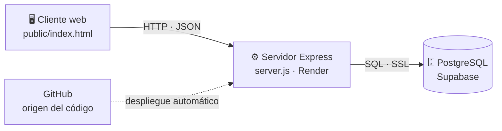
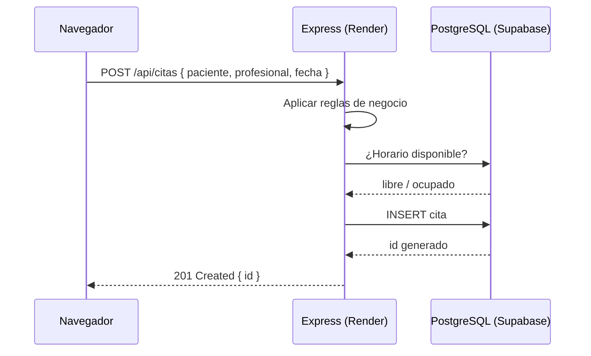

<div align="center">

# Reserva de Citas — Demo Cliente-Servidor

Sistema de referencia del curso **Arquitectura de Sistemas I** · Universidad Central · 2026-2

[](https://nodejs.org)
[](https://expressjs.com)
[](https://supabase.com)
[](https://render.com)

**[🌐 Demo en vivo](https://eng-demo-citas.onrender.com)** ·
**[📖 Guía de despliegue completa](https://eng-demo-citas.onrender.com/blog-semana-7.html)**

</div>

---

Aplicación mínima que demuestra el estilo arquitectónico **Cliente-Servidor** con tres piezas que residen en lugares físicamente distintos y se comunican por la red. El cliente es deliberadamente "tonto" (solo muestra datos y envía peticiones); toda la lógica de negocio y el acceso a datos viven en el servidor.

> **Nota conceptual:** Cliente-Servidor nombra una *relación* de solicitud/provisión, no una cantidad de piezas. El navegador es cliente de Express, y Express, a su vez, es cliente de PostgreSQL.

## Arquitectura



En esta versión (Semana 7), el servidor concentra **todo** en un archivo: rutas, reglas de negocio y SQL conviven en `server.js`. Es un punto de partida deliberado — en la Semana 8 se refactoriza en capas.

### Flujo de una reserva



## API

| Método | Ruta | Descripción | Respuestas |
|--------|------|-------------|-----------|
| `GET` | `/api/salud` | Verificación de vida del servidor | `200` |
| `GET` | `/api/profesionales` | Catálogo de profesionales | `200` |
| `GET` | `/api/citas` | Lista de citas (con nombre del profesional) | `200` |
| `POST` | `/api/citas` | Crea una cita aplicando las reglas de negocio | `201` creada · `400` datos faltantes o fecha inválida/pasada · `409` agenda ocupada |

**Reglas de negocio** (aplicadas siempre en el servidor, aunque el cliente intente evadirlas):
datos obligatorios · fecha válida · fecha futura · un profesional no puede tener dos citas a la misma hora.

## Estructura del proyecto

```
demo-cliente-servidor/
├── server.js               # Servidor Express: rutas + reglas + SQL (todo junto, a propósito)
├── public/
│   ├── index.html          # Cliente web: solo fetch() y pintar — cero reglas
│   └── blog-semana-7.html  # Guía de despliegue publicada por el propio servidor
├── db/
│   └── setup.sql           # Tablas y datos semilla (se ejecuta una vez en Supabase)
├── package.json            # Dependencias: express, pg, cors, dotenv
└── .env.example            # Plantilla de configuración (la real nunca se sube)
```

## Ejecución local

Requiere [Node.js](https://nodejs.org) ≥ 18 y una base de datos en Supabase ([guía completa](https://eng-demo-citas.onrender.com/blog-semana-7.html), sección 3).

```bash
npm install
cp .env.example .env     # editar y pegar la cadena del Transaction pooler de Supabase
npm start                # → http://localhost:3000
```

## Despliegue en la nube (planes gratuitos)

Resumen del flujo — el paso a paso completo, con solución de problemas, está en la [guía de despliegue](https://eng-demo-citas.onrender.com/blog-semana-7.html):

1. **Supabase** — crear proyecto, ejecutar `db/setup.sql` en el SQL Editor, copiar la cadena del **Transaction pooler** (puerto `6543`).
2. **GitHub** — subir el código (sin `.env` ni `node_modules`).
3. **Render** — New Web Service → este repositorio → Build `npm install` · Start `node server.js` · Instance **Free** → variable de entorno `DATABASE_URL`.

> ⏱️ El plan gratuito de Render duerme el servicio tras ~15 min sin tráfico; el primer acceso tarda 30–60 s. El de Supabase pausa el proyecto tras 7 días de inactividad (**Restore project** lo reactiva).

## Pruebas de rendimiento

El sistema se mide con [autocannon](https://github.com/mcollina/autocannon) (throughput y latencia por percentiles):

```bash
npx autocannon -c 10 -d 20 https://eng-demo-citas.onrender.com/api/citas
```

El protocolo completo — latencia con y sin base de datos, escrituras bajo concurrencia y experimentos comparativos — está en la sección 7 de la guía. Nota: la prueba de escrituras concurrentes *observa* la regla de agenda bajo carga; no garantiza exclusión (la implementación verifica-e-inserta en dos pasos, sin restricción de unicidad — una condición de carrera conservada deliberadamente como material de clase).

## Mapa del código ↔ conceptos de la clase

| Concepto (estilo Cliente-Servidor) | Dónde verlo en este proyecto |
|---|---|
| Proveedor y consumidor | `server.js` (proveedor) · `public/index.html` (consumidor) |
| El cliente solo representa datos y detona acciones | `index.html`: solo `fetch()` + pintar; cero reglas |
| Centralización de datos y lógica | Las reglas de negocio viven en `POST /api/citas` del servidor |
| Comunicación por red y protocolos | HTTP entre cliente y servidor · SQL/SSL entre servidor y Supabase |
| Múltiples clientes, un servidor | Todos los dispositivos del curso contra la misma URL |
| "Todo o nada" | Suspender el servicio en Render y recargar el cliente |
| Tecnologías distintas, mismo protocolo | HTML/JS en el navegador · Node en el servidor · Postgres en los datos |
| Roles según la interacción | Express: servidor del navegador y cliente de PostgreSQL |

## Ruta del curso

| Semana | Tema | Este repositorio |
|--------|------|------------------|
| **7** | Vista Cliente-Servidor | ✅ Versión actual: `server.js` plano + despliegue |
| **8** | Arquitectura en Capas | 🔜 Refactorización del mismo sistema (presentación · aplicación · dominio · persistencia) |
| **9** | Reglas de dependencia | DIP · patrón Repository · inyección de dependencias |

---

<div align="center">
<sub>Universidad Central · Ingeniería de Sistemas · Arquitectura de Sistemas I · 2026-2 · Prof. Elias Buitrago Bolivar</sub>
</div>
